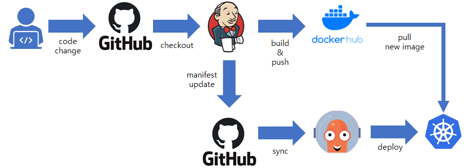

# MyK8s

## autoscaling
- HorizontalPodAutoscaler
## dashboard
- Kubernetes Dashboard
## Jenkins
- 젠킨스 설치

## kustomize
- kustomize 예시

## logging
- Elasticsearch, fluentd, kibana 사용, 로그 수집 저장 시각화
## monitoring
- Metric Server, Prometheus
## mydjango
- mydjango pod 설치

